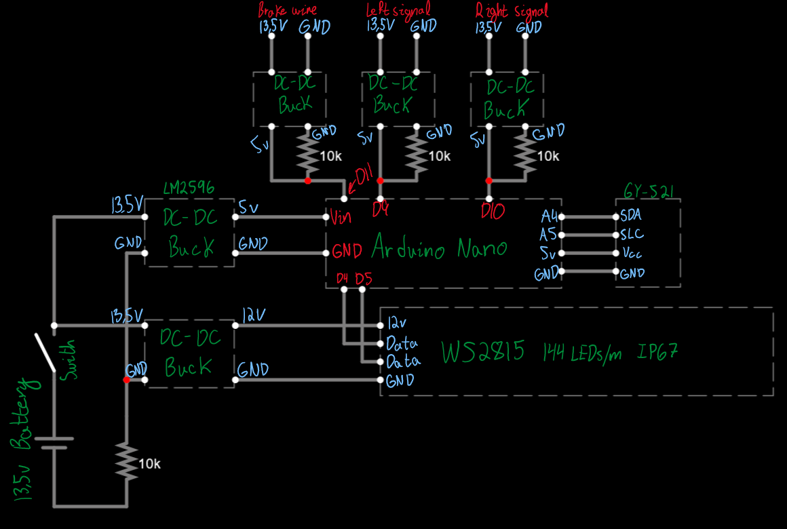

# Motorcycle-Signals
This is an Arduino based project focused on insuring road safety of motorcyclist.
The main premise of this project is to add a LED strip to the rear of a motorcycle, displaying things like the rate of deceleration and signals in a sequential manner. This allows vehicles behind the motorcyclist to know just HOW MUCH they are braking, instead of only having a binary feedback look (brake light ON/OFF).

Additionally, due to engine braking being so strong, a gyroscope will be used instead of a simple switch to ensure accurate reports on the deceleration of the motorcyclist.

